# Awesome-Cloud-Cold-Storage-Data-Archiving

# Awesome-Cloud-Cold-Storage-Data-Archiving 🧊 🗄️

  

  

  

  

  

  

  

---

## 🌟 Top Cloud Cold Storage & Data Archiving Ecosystem

**Curated List of Commercial Archival Platforms & Open-Source Cold Storage Tools**  

*Focused on Long-Term Retention, Retrieval Cost Optimization, Immutable Archives, Tape Integration & Self-Hosted Object Storage*

**Last updated: October 2026** 📅

---

### 📌 Overview & SEO Summary

Welcome to the ultimate curated directory of **cloud cold storage platforms**, **open-source archival storage systems**, and **data preservation frameworks**. Whether you are looking for enterprise-grade commercial solutions (such as *AWS S3 Glacier*, *Azure Archive*, and *Wasabi*), or self-hostable open-source alternatives (like *Ceph*, *MinIO*, and *s3ql*), this list covers category leaders, immutable archive strategies, and privacy-respecting long-term retention.

---

## 📑 Table of Contents

- [🏢 SaaS & Commercial Platforms](#-saas--commercial-platforms)

- [🔓 Open-Source GitHub Projects](#-open-source-github-projects)

- [🛠️ How to Contribute](#%EF%B8%8F-how-to-contribute)

- [📊 Star History](#-star-history)

- [🤝 Support & Sponsorship](#-support--sponsorship)

- [⚠️ Disclaimer](#%EF%B8%8F-disclaimer)

---

## 🏢 SaaS / Commercial Platforms

The cold storage and archiving market spans **hyperscaler archive tiers** (Glacier, Azure Archive, GCP Archive) that charge low storage rates but impose retrieval fees and minimum retention durations, and **flat-rate providers** (Wasabi, Backblaze B2) that charge slightly more for storage but eliminate egress fees and retrieval delays. **AWS S3 Glacier** charges **$0.00099/GB-month for Deep Archive** with 12–48 hour retrieval and **$0.0025/GB retrieval fee** . **Wasabi** charges **$0.0069/GB-month with free egress** (subject to fair-use caps) and **90-day minimum retention** . **Backblaze B2** charges **$0.006/GB-month with $0.01/GB egress** and no minimum retention . **Spectra Logic BlackPearl** provides on-premises archive solutions scaling from **80TB to 20PB per system**, with ransomware-resilient features including **triggered immutable snapshots**, **multi-factor authentication**, and **offline tape air gaps** .

| SaaS / Commercial Platform | Company / Owner | Valuation / Market Cap | Standard Edition Starting Price | Free Tier / Free Trial Limits | Description |

| :--- | :--- | :--- | :--- | :--- | :--- |

| **[Amazon S3 Glacier](https://aws.amazon.com/s3/storage-classes/glacier/)** ☁️ | Amazon | ~$2.0 Trillion | **Deep Archive: $0.00099/GB-month**; retrieval: **$0.0025/GB** | **Free tier: 10 GB Glacier storage for 12 months** | **AWS-native cold storage** — Three tiers: Instant Retrieval (ms), Flexible Retrieval (minutes–12 hrs), Deep Archive (12–48 hrs). **Minimum retention: 90–180 days** for Deep Archive. **Egress fees apply** on restore to non-AWS destinations . |

| **[Google Cloud Archive Storage](https://cloud.google.com/storage/docs/storage-classes)** 🌐 | Google (Alphabet) | ~$2.0 Trillion | **$0.0012/GB-month**; retrieval: **$0.05/GB** | **$300 free credits** for new customers | **GCP-native cold storage** — Designed for data accessed less than once per year. **Minimum storage duration: 365 days**. Instant retrieval available but at higher cost. |

| **[Azure Archive Blob Storage](https://azure.microsoft.com/en-us/products/storage/blobs/)** 🔷 | Microsoft | ~$3.90 Trillion | **$0.00099/GB-month**; retrieval: **$0.02/GB** | **Free tier: 5 GB LRS hot storage for 12 months** | **Azure-native cold storage** — **Rehydration from Archive takes up to 15 hours**. **Minimum retention: 180 days**. Early deletion fees apply. |

| **[Wasabi Hot Cloud Storage](https://wasabi.com/)** 🟢 | Wasabi Technologies | Private | **$0.0069/GB-month**; **free egress** (fair-use caps) | **Free trial available** | **Flat-rate cloud storage** — **No egress fees, no retrieval fees, no API request charges**. **90-day minimum retention**. **S3-compatible** with immediate access — no rehydration delay . |

| **[Backblaze B2 Archive](https://www.backblaze.com/cloud-storage)** 🔵 | Backblaze | Private | **$0.006/GB-month**; **$0.01/GB egress** | **Free tier: 10 GB storage** | **Simple cloud storage** — **No minimum retention duration**. S3-compatible. **Immediate access** — no rehydration. **Cloudflare integration eliminates egress fees** for certain traffic . |

| **[Spectra Logic BlackPearl](https://spectralogic.com/)** 🎞️ | Spectra Logic | Private | Custom enterprise pricing; **80TB to 20PB per system** | **Demo available** | **On-premises digital archive** — **Ransomware-resilient** with virtual air gaps, immutable snapshots, and offline tape copies. **Scales to 6.4 exabytes** with TFinity Plus tape libraries. **NAS, S3, and tape interfaces** . |

| **[Scality ARTESCA](https://www.scality.com/artesca/)** 🏗️ | Scality | Private | Custom enterprise pricing | **Free trial available** | **Software-defined object storage** — S3-compatible. Designed for **cloud-native applications and data archiving**. |

| **[Iron Mountain Cloud Archive](https://www.ironmountain.com/)** 🏔️ | Iron Mountain | ~$10 Billion | Custom enterprise pricing | **Demo available** | **Managed archive services** — Physical and cloud archive integration. **Compliance-focused** for regulated industries. |

| **[Quantum ActiveScale](https://www.quantum.com/)** ⚛️ | Quantum | ~$500 Million | Custom enterprise pricing | **Demo available** | **Object storage and archive** — **Scales to exabytes**. Designed for **long-term data preservation** with S3 compatibility. |

| **[CTERA Cloud Archive](https://www.ctera.com/)** 📁 | CTERA | Private | From **$12,000/year** | **Free trial available** | **Edge-to-cloud file services** — **Intelligent Data Platform** for hybrid cloud file services. Integrates with cloud cold storage tiers. |

---

## 🔓 Open-Source GitHub Projects

*Sorted by GitHub_Stars_Count (Descending)* 🌟

- **[Ceph](https://github.com/ceph/ceph)**   

  **The most widely deployed open-source distributed storage system**, LGPL-2.1 / GPL-2.0 / BSD-3-Clause licensed. **14,116 stars**. **Unified object, block, and file storage** from a single cluster on commodity hardware. **RADOS Gateway** provides S3-compatible object storage. **Erasure coding** for cost-efficient cold data storage. **The foundation for many commercial archive solutions**. 🐙

- **[MinIO](https://github.com/minio/minio)**   

  **High-performance S3-compatible object storage**, AGPL-3.0 licensed. **~45k+ stars**. **Single binary deployment** — runs on any hardware. **Erasure coding, bit-rot protection, and encryption**. **S3 Select for efficient data retrieval**. **The most popular self-hosted S3 alternative** — ideal for building private cold storage tiers. 🎯

- **[s3ql](https://github.com/s3ql/s3ql)**   

  **Full-featured file system for online data storage**, GPL-3.0 licensed. **1,000+ stars**. **Stores all data online** using S3, Google Storage, or OpenStack. **Provides infinite-capacity hard disk** accessible from any computer. **Compression, encryption, data de-duplication, immutable trees, and snapshotting** — **especially suitable for online backup and archival** . 💾

- **[restic](https://github.com/restic/restic)**   

  **Fast, secure, efficient backup program**, BSD-2-Clause licensed. **~28k+ stars**. **Single binary**, supports S3, GCS, Azure, B2, SFTP, REST. **Deduplication, encryption, incremental snapshots**. **Ideal for cold storage backups** — writes directly to archive tiers. ⚡

- **[rclone](https://github.com/rclone/rclone)**   

  **The Swiss army knife of cloud storage sync**, MIT licensed. **~50k+ stars**. **Supports 70+ cloud storage providers** including all major cold storage tiers. **Sync, copy, move, mount, and serve capabilities**. **Lifecycle automation** — moving data between hot and cold tiers . 🔗

- **[ferro](https://github.com/WyattAu/ferro)**   

  **High-performance self-hosted file storage platform**, open-source. **Rust-based** with WebDAV, OIDC, WASM, S3, and full-text search. **Storage backends**: local, S3, GCS, Azure Blob. **Snapshot management and audit log**. **WOPI protocol support** for document editing . 🦀

- **[Warehouse](https://codeberg.org/ultravioletasdf/warehouse)**   

  **Distributed object storage system (S3 alternative)**, open-source. **Fully self-hostable**. **Optimized for small files** — 17 bytes metadata overhead vs 256+ bytes in ext4. **Direct connections with JWT** for uploads/reads. **Chunking for large files** (80 MiB chunks) . 📦

- **[OpenIO](https://github.com/openio-sds/openio)**   

  **Distributed object storage software**, AGPL-3.0 licensed. **Modular architecture** adapting to different hardware types. **S3 API compatibility**. **Replication and automatic repair** for data resilience. **Encryption at rest and in transit** . 🌐

- **[Nextcloud](https://github.com/nextcloud/server)**   

  **Self-hosted productivity platform**, AGPL-3.0 licensed. **~27k+ stars**. **File synchronization and sharing** with **external storage support** for S3, SMB, and FTP. **Server-side encryption**. **Integrates with cold storage backends** for archival workflows. ☁️

- **[Seafile](https://github.com/haiwen/seafile)**   

  **High-performance file sync and share**, AGPL-3.0 licensed. **~13k+ stars**. **Delta sync** for efficient transfers. **Library encryption and versioning**. **Supports S3-compatible backends** for archival. 🗂️

- **[Duplicati](https://github.com/duplicati/duplicati)**   

  **Encrypted backup to cloud storage**, LGPL-2.1 licensed. **~11k+ stars**. **Stores encrypted, incremental, compressed backups** to 20+ cloud providers including **S3 Glacier, Azure Archive, and Backblaze B2**. **AES-256 encryption**. **Web-based UI and CLI** . 🔐

- **[Kopia](https://github.com/kopia/kopia)**   

  **Fast and secure backup/sync tool**, Apache-2.0 licensed. **~8k+ stars**. **Client-side end-to-end encryption**, deduplication, and compression. **Snapshot-based with policy-driven retention**. **Supports cold storage backends**. 🛡️

---

## 🛠️ How to Contribute

Contributions are welcome! Follow these steps to submit new cold storage platforms or open-source archival software:

1. 🍴 **Fork** the repository.

2. 📝 **Add/edit** entries in `README.md` maintaining table/list structure and formatting.

3. 🔗 Include project title, official website/GitHub link, exact Stars_Count, license, and brief description.

4. 🚀 Submit a **Pull Request** with a descriptive summary of your changes.

---

## 📊 Star History

---

## 🤝 Support & Sponsorship

If you find this cloud cold storage repository useful, please consider supporting the project:

- ⭐ **Star** this repository to increase visibility!

- 🔀 **Fork** and share with fellow storage engineers, compliance officers, and open-source advocates.

- ☕ **Sponsor & Buy Me a Coffee**: Support ongoing open-source curation via the [GitHub Sponsor Dashboard](https://github.com/sponsors/ishandutta2007).

---

## ⚠️ Disclaimer

- This is a **community-curated** list — not exhaustive and not an endorsement. ℹ️

- **Retrieval fees dominate cold storage TCO for frequently accessed data**: AWS Glacier Deep Archive charges **$0.0025/GB retrieval** plus **$0.09/GB egress** if restoring outside AWS. A **100TB restore costs ~$11,000** in retrieval and egress fees alone . **Wasabi and Backblaze B2 eliminate these fees** — Wasabi's free egress and B2's Cloudflare integration make them cheaper for DR workloads with periodic restore testing .

- **Minimum retention penalties apply**: AWS Deep Archive requires **180-day minimum retention**; Wasabi requires **90 days**. Deleting data early still incurs charges as if the data remained for the full period .

- **Tape remains the cheapest long-term archive**: Spectra on-premises tape archive costs **$0.0038/GB/month** over 5 years vs **$0.012/GB/month** for cloud storage — a **~3x cost advantage** at 5PB scale . Tape also provides **physical air gap** for ransomware resilience that cloud immutability cannot replicate .

- Open-source solutions (Ceph, MinIO, s3ql, restic) provide self-hosted ownership and transparency, but enterprise-grade SLA guarantees, managed infrastructure, and tape library automation remain primarily commercial offerings. **Always model retrieval costs against your actual access patterns** before committing to a cold storage tier. 🧊

---

  <b>Made with ❤️ for storage engineers, compliance officers, and open-source archival advocates.</b>

